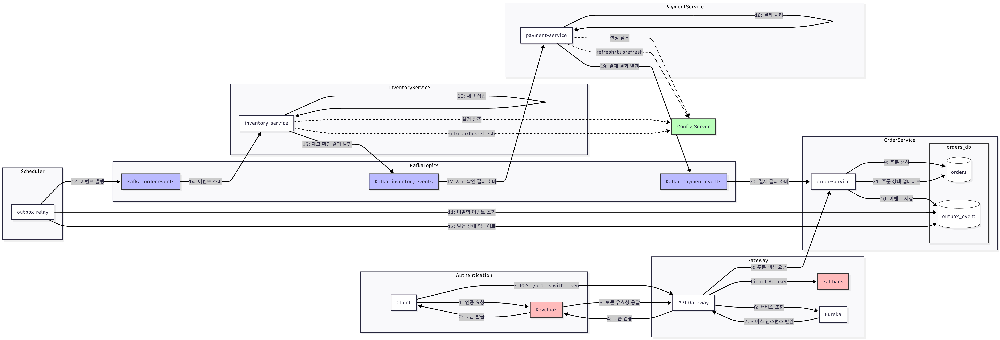
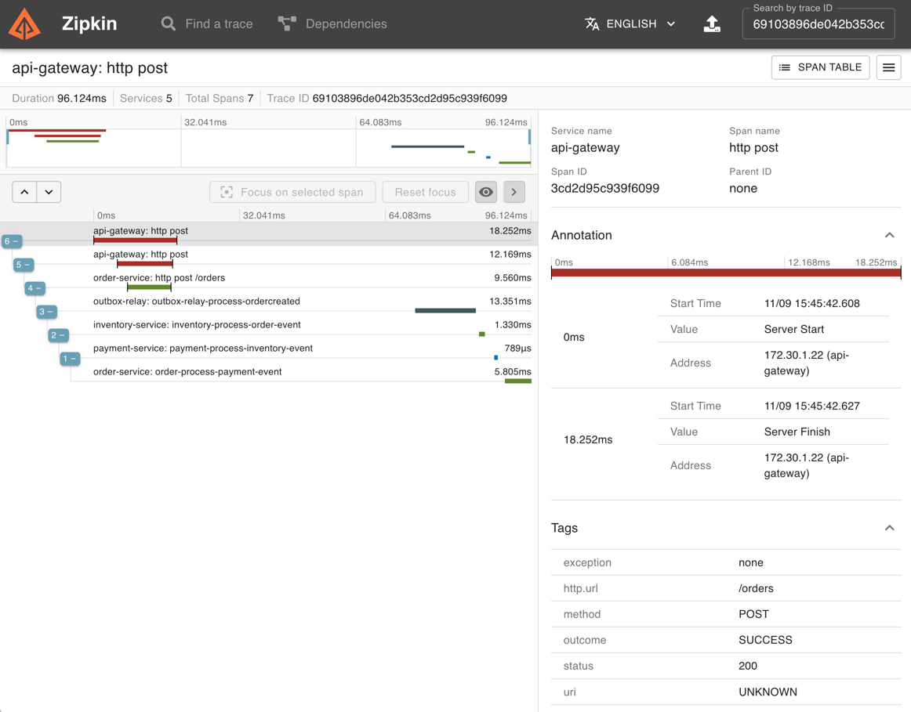

# 🚀 MSA 주문/클레임 시스템 - 이벤트 기반 마이크로서비스 아키텍처

## 📋 목차

1. [프로젝트 개요](#-프로젝트-개요)
2. [시스템 아키텍처](#시스템-아키텍처)
3. [기술 스택](#기술-스택)
4. [핵심 패턴 상세](#-핵심-패턴-상세)
5. [서비스별 상세](#-서비스별-상세)
6. [이벤트 흐름](#-이벤트-흐름)
7. [API 명세](#-api-명세)
8. [실행 방법](#-실행-방법)
9. [개발 로드맵](#-개발-로드맵)

---

## 🎯 프로젝트 개요

### 시나리오

> "주문 생성 시 재고 확인 → 결제 처리 → 주문 승인/취소가 이벤트 기반으로 비동기 처리되는 마이크로서비스 시스템"

이 프로젝트는 **Transactional Outbox 패턴**과 **Saga 패턴**을 적용하여 분산 환경에서 데이터 일관성을 보장하는 주문/클레임 관리 시스템입니다.

### 핵심 설계 원칙

| 원칙 | 설명 | 적용 기술 |
|------|------|----------|
| **이벤트 기반 통신** | 서비스 간 느슨한 결합 | Apache Kafka |
| **데이터 일관성** | 분산 트랜잭션 없이 일관성 보장 | Outbox 패턴, Saga 패턴 |
| **장애 격리** | 서비스 장애 전파 방지 | Circuit Breaker (Resilience4j) |
| **서비스 디스커버리** | 동적 서비스 등록/조회 | Netflix Eureka |
| **중앙 집중 설정** | 설정 외부화 및 동적 갱신 | Spring Cloud Config |
| **분산 추적** | 서비스 간 요청 흐름 추적 | Zipkin, Micrometer Tracing |
| **멱등성 보장** | 중복 메시지 처리 방지 | ProcessedMessage 테이블 |

---

## <a id="시스템-아키텍처"></a>🏗️ 시스템 아키텍처

### 전체 구조

[](flow_chart.png?raw=true)

```
┌─────────────────────────────────────────────────────────────────────────────┐
│                                  Client                                      │
└─────────────────────────────────────┬───────────────────────────────────────┘
                                      │ 1. POST /orders
                                      ▼
┌─────────────────────────────────────────────────────────────────────────────┐
│                           API Gateway (:8080)                                │
│                    - Circuit Breaker (Resilience4j)                         │
│                    - Service Discovery (Eureka)                             │
└─────────────────────────────────────┬───────────────────────────────────────┘
                                      │
              ┌───────────────────────┼───────────────────────┐
              │                       │                       │
              ▼                       ▼                       ▼
    ┌─────────────────┐     ┌─────────────────┐     ┌─────────────────┐
    │  order-service  │     │inventory-service│     │ payment-service │
    │     (:9001)     │     │                 │     │                 │
    └────────┬────────┘     └────────┬────────┘     └────────┬────────┘
             │                       │                       │
             ▼                       │                       │
    ┌─────────────────┐              │                       │
    │   PostgreSQL    │              │                       │
    │  ┌───────────┐  │              │                       │
    │  │  orders   │  │              │                       │
    │  ├───────────┤  │              │                       │
    │  │  outbox   │  │              │                       │
    │  │  _event   │  │              │                       │
    │  └───────────┘  │              │                       │
    └────────┬────────┘              │                       │
             │                       │                       │
             ▼                       │                       │
    ┌─────────────────┐              │                       │
    │  outbox-relay   │              │                       │
    │   (Scheduler)   │              │                       │
    └────────┬────────┘              │                       │
             │                       │                       │
             ▼                       ▼                       ▼
    ┌─────────────────────────────────────────────────────────────────┐
    │                         Apache Kafka                             │
    │  ┌───────────────┐  ┌───────────────┐  ┌───────────────┐       │
    │  │ order.events  │  │inventory.events│  │payment.events │       │
    │  └───────────────┘  └───────────────┘  └───────────────┘       │
    └─────────────────────────────────────────────────────────────────┘
```

### 분산 추적 (Zipkin)

모든 서비스 간 통신에서 traceId가 전파되어 전체 요청 흐름을 추적할 수 있습니다.

[](zipkin.png?raw=true)

---

## <a id="기술-스택"></a>🛠️ 기술 스택

### Core

| 기술 | 버전 | 용도 |
|------|------|------|
| **Java** | 21 | 최신 LTS 버전 |
| **Spring Boot** | 3.3.3 | 애플리케이션 프레임워크 |
| **Spring Cloud** | 2023.0.3 | 클라우드 네이티브 도구 |
| **Gradle** | 8.x | 빌드 도구 (멀티 모듈) |

### 마이크로서비스 인프라

| 기술 | 용도 |
|------|------|
| **Spring Cloud Gateway** | API 게이트웨이, 라우팅, 필터링 |
| **Netflix Eureka** | 서비스 디스커버리 |
| **Spring Cloud Config** | 중앙 집중식 설정 관리 |
| **Spring Cloud Bus** | 설정 변경 브로드캐스트 |

### 메시징 & 이벤트

| 기술 | 용도 |
|------|------|
| **Apache Kafka** | 이벤트 스트리밍 플랫폼 |
| **Transactional Outbox** | 안정적인 이벤트 발행 |

### 회복성 & 장애 허용

| 기술 | 용도 |
|------|------|
| **Resilience4j** | Circuit Breaker, Rate Limiter, Retry |
| **Fallback** | 장애 시 대체 응답 |

### 데이터베이스

| 기술 | 용도 |
|------|------|
| **PostgreSQL 16** | 영구 저장소 (JSONB 지원) |
| **Spring Data JPA** | ORM, 데이터 액세스 |

### 관측성 & 모니터링

| 기술 | 용도 |
|------|------|
| **Zipkin** | 분산 추적 시각화 |
| **Micrometer Tracing** | 추적 컨텍스트 전파 |
| **Spring Boot Actuator** | 헬스 체크, 메트릭 |
| **Prometheus** | 메트릭 수집 (구성됨) |

---

## 🔄 핵심 패턴 상세

### 1️⃣ Transactional Outbox 패턴

데이터베이스 트랜잭션과 메시지 발행의 원자성을 보장합니다.

```
┌─────────────────────────────────────────────────────────────────┐
│                      order-service                               │
│  ┌─────────────────────────────────────────────────────────┐   │
│  │                   @Transactional                         │   │
│  │  1. orderRepository.save(order)     ─────┐               │   │
│  │  2. outboxRepository.save(event)    ─────┤ 동일 트랜잭션 │   │
│  │                                          │               │   │
│  └──────────────────────────────────────────┴───────────────┘   │
│                              │                                   │
│                              ▼                                   │
│  ┌─────────────────────────────────────────────────────────┐   │
│  │               PostgreSQL (orders DB)                     │   │
│  │  ┌─────────────┐        ┌─────────────────┐             │   │
│  │  │   orders    │        │   outbox_event  │             │   │
│  │  │  (PENDING)  │        │ (published=false)│             │   │
│  │  └─────────────┘        └─────────────────┘             │   │
│  └─────────────────────────────────────────────────────────┘   │
└─────────────────────────────────────────────────────────────────┘
                               │
                               │ 3. 폴링 (500ms 주기)
                               ▼
┌─────────────────────────────────────────────────────────────────┐
│                      outbox-relay                                │
│  ┌─────────────────────────────────────────────────────────┐   │
│  │  @Scheduled(fixedDelay = 500ms)                          │   │
│  │  @Transactional                                          │   │
│  │                                                          │   │
│  │  4. SELECT * FROM outbox_event                           │   │
│  │     WHERE published = false                              │   │
│  │     FOR UPDATE SKIP LOCKED                               │   │
│  │     LIMIT 50                                             │   │
│  │                                                          │   │
│  │  5. kafka.send(event)                                    │   │
│  │  6. event.setPublished(true)  // dirty checking         │   │
│  └─────────────────────────────────────────────────────────┘   │
└─────────────────────────────────────────────────────────────────┘
```

**OutboxEvent 엔티티:**

```java
@Entity
@Table(name = "outbox_event",
    uniqueConstraints = @UniqueConstraint(
        name = "uk_outbox_once",
        columnNames = {"aggregate_id", "type", "payload_hash"}))
public class OutboxEvent {
    @Id @GeneratedValue(strategy = GenerationType.IDENTITY)
    private Long id;
    
    private String aggregateType;  // "ORDER"
    private String aggregateId;    // orderId
    private String type;           // "OrderCreated"
    
    @JdbcTypeCode(SqlTypes.JSON)
    @Column(columnDefinition = "jsonb")
    private JsonNode payload;      // 이벤트 데이터
    
    private String payloadHash;    // SHA-256 (중복 방지)
    private boolean published;     // 발행 여부
    private Instant createdAt;
}
```

**장점:**
- At-least-once 전달 보장 (메시지 유실 방지)
- 분산 트랜잭션 없이 데이터 일관성 유지
- 서비스 장애 시에도 이벤트 발행 보장

---

### 2️⃣ Saga 패턴 (Choreography 방식)

분산 환경에서 여러 서비스에 걸친 비즈니스 트랜잭션을 관리합니다.

```
┌─────────────────────────────────────────────────────────────────────────────┐
│                           주문 생성 Saga 흐름                                 │
├─────────────────────────────────────────────────────────────────────────────┤
│                                                                             │
│  ┌──────────────┐    OrderCreated     ┌──────────────┐                     │
│  │order-service │ ─────────────────► │inventory-svc │                     │
│  │              │                     │              │                     │
│  │ PENDING      │                     │ 재고 확인    │                     │
│  └──────────────┘                     └──────┬───────┘                     │
│         ▲                                    │                             │
│         │                          ┌─────────┴─────────┐                   │
│         │                          ▼                   ▼                   │
│         │               InventoryReserved    InventoryFailed              │
│         │                          │                   │                   │
│         │                          ▼                   │                   │
│         │               ┌──────────────┐               │                   │
│         │               │ payment-svc  │               │                   │
│         │               │              │               │                   │
│         │               │ 결제 처리    │               │                   │
│         │               └──────┬───────┘               │                   │
│         │                      │                       │                   │
│         │            ┌─────────┴─────────┐             │                   │
│         │            ▼                   ▼             │                   │
│         │   PaymentAuthorized    PaymentFailed         │                   │
│         │            │                   │             │                   │
│         └────────────┴───────────────────┴─────────────┘                   │
│                      │                   │                                 │
│                      ▼                   ▼                                 │
│               ┌──────────┐        ┌──────────┐                            │
│               │ APPROVED │        │CANCELLED │                            │
│               └──────────┘        └──────────┘                            │
│                                                                             │
└─────────────────────────────────────────────────────────────────────────────┘
```

**보상 트랜잭션 (Saga Compensation):**

결제 실패 시 inventory-service에서 예약한 재고를 해제해야 합니다.

```java
// PaymentEventHandler.java (order-service)
@KafkaListener(topics = "payment.events", groupId = "order")
public void onPaymentEvents(ConsumerRecord<String, String> rec) {
    JsonNode node = om.readTree(rec.value());
    UUID orderId = UUID.fromString(node.get("orderId").asText());
    
    boolean isFailure = node.has("reason");
    
    if (isFailure) {
        String reason = node.get("reason").asText();
        // 보상 트랜잭션: 주문 취소 → OrderCancelled 이벤트 발행
        // → inventory-service가 재고 해제
        orderService.cancel(orderId, reason);
    } else {
        orderService.approve(orderId);
    }
}
```

---

### 3️⃣ Circuit Breaker 패턴

장애가 발생한 서비스로의 요청을 차단하여 시스템 전체의 장애 전파를 방지합니다.

```
┌─────────────────────────────────────────────────────────────────┐
│                    Circuit Breaker 상태 전이                      │
├─────────────────────────────────────────────────────────────────┤
│                                                                 │
│    ┌──────────┐                              ┌──────────┐      │
│    │  CLOSED  │ ────────────────────────────►│   OPEN   │      │
│    │  (정상)   │   실패율 50% 초과 시          │  (차단)   │      │
│    └────▲─────┘                              └────┬─────┘      │
│         │                                         │            │
│         │        ┌──────────────┐                │            │
│         │        │  HALF_OPEN   │                │            │
│         └────────│  (반개방)     │◄───────────────┘            │
│          성공 시  │ 3회 테스트    │   10초 대기 후              │
│                  └──────────────┘                              │
│                         │                                      │
│                         │ 실패 시                               │
│                         └─────────────────► OPEN               │
│                                                                 │
└─────────────────────────────────────────────────────────────────┘
```

**API Gateway 설정:**

```yaml
# api-gateway/application.yml
spring:
  cloud:
    gateway:
      routes:
        - id: order
          uri: lb://order-service
          predicates:
            - Path=/orders/**
          filters:
            - name: CircuitBreaker
              args:
                name: orderCircuitBreaker
                fallbackUri: forward:/fallback/orders

resilience4j:
  circuitbreaker:
    instances:
      orderCircuitBreaker:
        slidingWindowType: COUNT_BASED
        slidingWindowSize: 10          # 최근 10개 호출 기준
        failureRateThreshold: 50       # 실패율 50% 초과 시 OPEN
        minimumNumberOfCalls: 5        # 최소 5회 호출 후 판단
        waitDurationInOpenState: 10s   # OPEN 상태 10초 유지
        permittedNumberOfCallsInHalfOpenState: 3  # HALF_OPEN에서 3회 테스트
```

---

### 4️⃣ 멱등성 (Idempotency) 보장

Kafka 메시지가 중복 전달되어도 동일한 결과를 보장합니다.

```java
// ProcessedMessage.java
@Entity
@Table(name = "processed_message",
    uniqueConstraints = @UniqueConstraint(
        name = "uk_topic_part_offset",
        columnNames = {"topic", "partition", "offset"}))
public class ProcessedMessage {
    @Id @GeneratedValue(strategy = GenerationType.IDENTITY)
    private Long id;
    
    private String topic;
    private int partitionId;
    private long offset;        // Kafka offset으로 유일성 보장
    private String messageKey;
    private Instant processedAt;
}

// PaymentEventHandler.java
@KafkaListener(topics = "payment.events", groupId = "order")
public void onPaymentEvents(ConsumerRecord<String, String> rec) {
    // 멱등성 체크: 동일한 메시지 재처리 방지
    try {
        processedRepo.save(ProcessedMessage.builder()
                .topic(rec.topic())
                .partitionId(rec.partition())
                .offset(rec.offset())
                .messageKey(rec.key())
                .build());
    } catch (DataIntegrityViolationException dup) {
        log.debug("Duplicate message detected, skipping");
        return;  // 이미 처리한 메시지
    }
    
    // 비즈니스 로직 실행...
}
```

---

## 📦 서비스별 상세

### 모듈 구조

```
msa-order-claim/
├── api-gateway/          # API 게이트웨이 (포트: 8080)
├── discovery/            # Eureka 서버 (포트: 8761)
├── config-server/        # Config 서버 (포트: 8888)
├── order-service/        # 주문 서비스 (포트: 9001)
├── inventory-service/    # 재고 서비스
├── payment-service/      # 결제 서비스
├── claim-service/        # 클레임 서비스 (개발 중)
├── outbox-relay/         # Outbox 이벤트 릴레이
├── common-lib/           # 공통 라이브러리
└── docker/               # Docker Compose 설정
```

### 핵심 서비스

| 서비스 | 포트 | 역할 |
|--------|------|------|
| **order-service** | 9001 | 주문 생성, 상태 관리, 이벤트 발행 |
| **inventory-service** | - | 재고 확인/예약, InventoryReserved 발행 |
| **payment-service** | - | 결제 처리, PaymentAuthorized 발행 |
| **outbox-relay** | - | Outbox → Kafka 이벤트 릴레이 |

### 인프라 서비스

| 서비스 | 포트 | 역할 |
|--------|------|------|
| **api-gateway** | 8080 | 라우팅, Circuit Breaker, 인증 |
| **discovery** | 8761 | 서비스 등록/조회 (Eureka) |
| **config-server** | 8888 | 중앙 집중식 설정 관리 |

---

## 🔄 이벤트 흐름

### 주문 생성 → 승인 플로우

```
1. Client → API Gateway → order-service
   POST /orders { "userId": "user1", "totalAmount": 10000 }

2. order-service
   - Order 엔티티 저장 (status: PENDING)
   - OutboxEvent 저장 (type: OrderCreated, published: false)
   - 응답 반환: { "orderId": "uuid" }

3. outbox-relay (500ms 폴링)
   - OutboxEvent 조회 (published: false)
   - Kafka "order.events" 토픽으로 발행
   - published = true 업데이트

4. inventory-service (order.events 구독)
   - OrderCreated 이벤트 수신
   - 재고 확인 (시뮬레이션: 80% 성공)
   - InventoryReserved 이벤트 발행 → "inventory.events"

5. payment-service (inventory.events 구독)
   - InventoryReserved 이벤트 수신
   - 결제 처리 (시뮬레이션: 90% 성공)
   - PaymentAuthorized 이벤트 발행 → "payment.events"

6. order-service (payment.events 구독)
   - PaymentAuthorized 이벤트 수신
   - Order 상태 변경: PENDING → APPROVED
   - OrderApproved 이벤트 발행
```

### Kafka 토픽

| 토픽 | 발행 서비스 | 구독 서비스 | 이벤트 타입 |
|------|------------|------------|------------|
| `order.events` | order-service | inventory-service | OrderCreated, OrderApproved, OrderCancelled |
| `inventory.events` | inventory-service | payment-service | InventoryReserved, InventoryFailed |
| `payment.events` | payment-service | order-service | PaymentAuthorized, PaymentFailed |

---

## 📡 API 명세

### Order API

#### 주문 생성

```http
POST /orders
Content-Type: application/json

{
  "userId": "hyot.ahn",
  "totalAmount": 17500
}
```

**Response (201 Created):**

```json
{
  "orderId": "39732f2c-713b-4deb-a012-f45b64d6e4f8"
}
```

#### 주문 조회

```http
GET /orders/{orderId}
```

**Response (200 OK):**

```json
{
  "id": "39732f2c-713b-4deb-a012-f45b64d6e4f8",
  "userId": "hyot.ahn",
  "totalAmount": 17500,
  "status": "APPROVED"
}
```

### 주문 상태 (OrderStatus)

| 상태 | 설명 |
|------|------|
| `PENDING` | 주문 생성됨, 재고 확인 및 결제 대기 중 |
| `APPROVED` | 재고 확보 및 결제 완료 |
| `CANCELLED` | 재고 부족 또는 결제 실패로 취소됨 |

---

## 💻 실행 방법

### 사전 요구 사항

- Java 21
- Docker & Docker Compose
- Gradle

### 1. 인프라 서비스 시작

```bash
# Kafka, Zookeeper, PostgreSQL, Zipkin 시작
docker-compose -f docker/docker-compose.yml up -d
```

### 2. 애플리케이션 순차 실행

```bash
# 1) Discovery (Eureka)
./gradlew :discovery:bootRun

# 2) Config Server
./gradlew :config-server:bootRun

# 3) Core Services (별도 터미널에서 각각 실행)
./gradlew :order-service:bootRun
./gradlew :inventory-service:bootRun
./gradlew :payment-service:bootRun

# 4) Outbox Relay
./gradlew :outbox-relay:bootRun

# 5) API Gateway
./gradlew :api-gateway:bootRun
```

### 3. 테스트

```bash
# 주문 생성
curl -X POST http://localhost:8080/orders \
  -H "Content-Type: application/json" \
  -d '{"userId": "test", "totalAmount": 10000}'

# 주문 조회
curl http://localhost:8080/orders/{orderId}
```

### 모니터링 접속

| 서비스 | URL |
|--------|-----|
| Eureka Dashboard | http://localhost:8761 |
| Zipkin UI | http://localhost:9411 |
| Kafka UI | http://localhost:8085 |
| Config Server | http://localhost:8888/application/default |

---

## 🛠️ Docker 서비스 구성

```yaml
# docker/docker-compose.yml
services:
  zookeeper:        # Kafka 메타데이터 관리
    ports: ["2181:2181"]
    
  kafka:            # 이벤트 스트리밍
    ports: ["29092:29092"]
    
  kafka-ui:         # Kafka 모니터링
    ports: ["8085:8080"]
    
  zipkin:           # 분산 추적
    ports: ["9411:9411"]
    
  postgres-order:   # Order DB
    ports: ["5433:5432"]
    
  postgres-claim:   # Claim DB
    ports: ["5434:5432"]
```

---

## 📈 개발 로드맵

### 완료된 기능

- [x] Transactional Outbox 패턴
- [x] Saga 패턴 (Choreography)
- [x] Circuit Breaker (Resilience4j)
- [x] 서비스 디스커버리 (Eureka)
- [x] 중앙 집중 설정 (Config Server)
- [x] 분산 추적 (Zipkin)
- [x] 멱등성 보장 (ProcessedMessage)
- [x] API Gateway 라우팅

### 계획된 기능

- [ ] Keycloak 인증/인가 통합
- [ ] OAuth2/OpenID Connect 구현
- [ ] Prometheus + Grafana 모니터링
- [ ] claim-service 완전 구현
- [ ] SpringDoc OpenAPI 문서화
- [ ] Kubernetes 배포 설정

---

## 🎓 키워드 체크리스트

- [x] Transactional Outbox 패턴
- [x] Saga 패턴 (Choreography)
- [x] Circuit Breaker (Resilience4j)
- [x] API Gateway (Spring Cloud Gateway)
- [x] Service Discovery (Eureka)
- [x] Config Server (Spring Cloud Config)
- [x] Apache Kafka
- [x] 분산 추적 (Zipkin, Micrometer)
- [x] 멱등성 (Idempotency)
- [x] PostgreSQL JSONB
- [x] FOR UPDATE SKIP LOCKED
- [x] Dirty Checking (JPA)
- [x] B3/W3C Trace Context
- [x] Spring Boot Actuator
- [x] Fallback 메커니즘

---

## 📄 라이센스

MIT License
