# MSA 기반 주문/클레임 시스템

## 📦 프로젝트 개요

실제 커머스 환경에서 발생하는 **주문 처리 및 클레임(취소/반품/교환) 업무를 MSA 아키텍처 기반으로 설계 및 구현**한 개인 프로젝트입니다. 단일 API 서버 중심 구조가 가진 확장성, 복원력, 트랜잭션 정합성 문제를 해결하기 위해, **이벤트 기반 아키텍처**, **Outbox & Saga 패턴**, **Kafka 기반 비동기 메시징**, **Config / Gateway 중심 구성**을 직접 설계하고 검증하는 데 목적을 두었습니다.

프로젝트는 각 도메인이 독립적으로 배포되고 장애를 고립할 수 있도록 설계되었으며, 데이터 정합성 보장, 장애 복구, 서비스 간 통신 전략, 운영 관점에서의 실험을 포함합니다.

---

## 🧱 주요 기능

* **주문 생성 / 결제 요청 / 상태 변경 처리**
* **취소 / 반품 / 교환** 등 클레임 플로우 수행
* **Kafka Event 기반 비동기 처리 모델 적용**
* **Outbox 패턴을 통한 데이터 정합성 보장**
* **Saga 패턴 기반 주문/재고/결제 서비스 간 상태 조정**
* **API Gateway + Config Server 기반 중앙 설정 관리**

---

## 🛠 기술 스택

| 분류           | 기술                                                                              |
| ------------ | ------------------------------------------------------------------------------- |
| Backend      | Java 21, Spring Boot, Spring Cloud 2023.x, JPA                                  |
| Infra        | Docker, Docker Compose, Kafka, Zookeeper                                        |
| Database     | MySQL                                                                           |
| Architecture | Event-driven Architecture, Outbox, Saga, API Gateway, Config Server |
| DevOps       | Gradle Multi-module 구조                                                          |

---

## 🧩 시스템 아키텍처 개요

서비스는 주문(Order), 결제(Payment), 재고(Inventory), 클레임(Claim) 등으로 분리되어 있으며, 각 서비스는 **독립 데이터베이스 및 배포 단위**를 가집니다.
상태 변경 이벤트는 **Outbox 테이블에 보관 > Kafka로 Publish > 소비 서비스 적용** 과정으로 전달되며, 장애 발생 시에도 데이터 유실을 방지하도록 구성했습니다.

모든 서비스 간 통신에서 traceId가 전파되어 전체 요청 흐름을 추적할 수 있습니다. 이를 통해 복잡한 마이크로서비스 환경에서도 요청의 전체 경로를 쉽게 파악하고 문제를 진단할 수 있습니다.

---

## 🎯 설계 포인트

* 단일 트랜잭션에 의존하지 않는 **분산 환경의 정합성 보장 전략 실험**
* 서비스 간 통신 전략 **동기(Rest) vs 비동기(Kafka)** 비교 및 트레이드오프 이해
* **Saga Orchestration / Choreography 흐름 비교 및 구현 실습**
* 장애 발생 시 **보상 트랜잭션 설계 및 재처리 전략 적용**

---

## 💡 프로젝트를 통해 얻은 인사이트

* 단일 서비스 구조에서는 체감하기 어려운 **분산 트랜잭션 문제 해결 경험**
* 운영 관점에서의 **복원력(Resilience)과 장애 대응 전략의 중요성**
* 서비스 경계 설정, 이벤트 설계, 정합성 유지 전략 등 **아키텍처적 사고 방식 강화**
* 실무 경험을 기반으로 한 **기술 실험 및 구조적 개선 역량 확보**

---

## 🔗 GitHub Repo

[https://github.com/hyot88/msa-order-claim](https://github.com/hyot88/msa-order-claim)

---

## 📝 기타 활동 및 프로젝트

* **개인 기술 블로그 운영**: [https://hyot88.github.io/](https://hyot88.github.io/)
  * 기술 학습 및 프로젝트 진행 과정, 문제 해결 과정을 기록하며 지식 정리 및 공유 활동을 지속하고 있습니다.
* **이전 진행 프로젝트 (ASAP)**
  * 1Day / 3Day / 5Day / 7Day 단위의 미션 계획을 설정하고 진행 상황을 시각화하여 성취감을 높이는 것이 목적이며, 꾸준한 실천을 유도하는 UI/UX와 심리적 동기 요소를 적용한 프로젝트입니다.
    * [https://github.com/hyot88/ASAP](https://github.com/hyot88/ASAP)
    * [https://github.com/hyot88/ASAP-api](https://github.com/hyot88/ASAP-api)

---

## 📍 Next Step

* 인증 및 권한 부여를 위한 Keycloak 통합
* 보안 API 액세스를 위한 OAuth2/OpenID Connect 구현
* Prometheus 및 Grafana를 통한 모니터링 및 알림 강화
* SpringDoc OpenAPI를 통한 포괄적인 API 문서화 
* claim-service의 완전한 구현